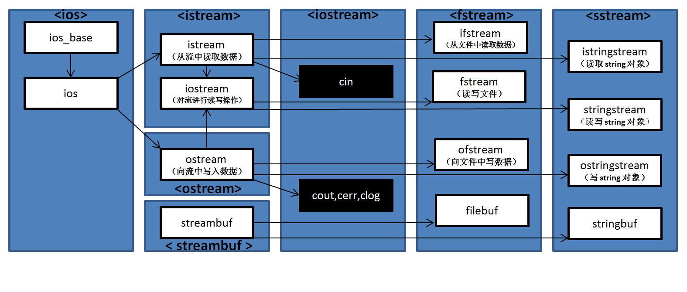
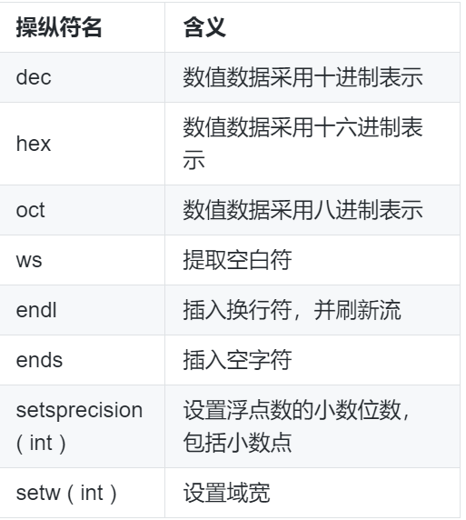

## 知识点  

C++ 语言的概述  
扩展名和注释符  
命名空间  
标准 I/O 库  
输入与输出  

## C++ 语言的产生  

C 语言最初是贝尔实验室的 Dennis Ritchie 在 B 语言的基础上开发出来的。C 语言具有运算符和数据结构丰富、语言简洁灵活、程序执行效率高等系列优点，被市场广泛应用。但 C 语言终究是面向过程的编程语言，与其他面向过程的编程语言一样，无法满足运用面向对象方法的开发需求。  

而 C++ 语言便是在优化 C 语言的基础上为支持面向对象的程序设计而研制的一个通用目的的程序设计语言。在后来的持续研究中，C++ 增加了许多新概念，例如虚函数、重载、继承、标准模板库、异常处理、命名空间等。  

C++ 语言的特点  
C++ 语言的特点主要表现在两个方面： 全面兼容 C 语言 和 支持面向对象的方法。  

由于 C++ 可以全面兼容 C，这就使得部分由 C 语言编写的代码在未经修改的情况下就可以为 C++ 所用，这极大的促进了 C++ 的普及和面向对象技术的广泛应用。  

C++ 最具有意义的一面就是支持面向对象的方法。与 C 兼容的特点虽赋予 C++ 双重特点，但 C 和 C++ 在概念上却是两种完全不同的程序设计语言，所以在 C++ 中应注意按照面向对象的思维去编写代码。  

此外，C++ 在保持 C 简洁、高效等特点的基础上，对 C 的类型系统进行改革和扩充，因此 C++ 编译环境能检测出的类型错误更多。  

## C++ 的扩展名和注释符

C++ 源文件的扩展名与运行的具体编译器有关，一般有 .cc、.cxx、.cpp 和 .cp。与源文件相关的头文件扩展名一般是 .h。课程实验环境中的源文件扩展名一般为 .cpp，与之相关的头文件扩展名一般为 .h。  

与其他语言类似，C++ 也有为代码提供辅助信息的注释符。

单行注释：//注释内容  

```cpp
int x;//定义 x 的数据类型为 int
```

块注释：/_ 注释内容 _/  

```cpp
if(x>y)return x;
else return y;
/* 如果 x 大于 y 则返回 x
否则返回 y */
```

注释符可以放置在代码的任何位置，且不参与代码运行。  

## 命名空间  

命名空间里面包含了逻辑结构上相互关联的一组类、函数、模板等。命名空间像是一个容器，把某些在逻辑结构上相关的 “ 对象 ” 放在一起并与外界区分。特别的，命名空间里的变量名或类名可以和命名空间外的变量名或类名重名。  

使用命名空间的时候，我们可以用 花括号 把声明块括起来，再以关键字 namespace 开头并命名，其基本格式如下：  

```cpp
namespace 命名空间的名字
{
    声明块
}
```

其中声明块中可以包含变量、类、函数等。例如：  

```cpp
namespace S
{
    int x;
    void FunA()
    {
        ...
    }
}
```

在命名空间外使用命名空间内的成员： 命名空间的名字加上作用域运算符 :: 。  

参考上例 namespace S，若访问 x，可写成 S::x；访问 FunA() 则为 S::FunA()。  

命名空间的嵌套， 具有分层屏蔽的作用。例如：  

```cpp
namespace S1
{
    namespace S2
    {
        int x;
        void FunA()
        {
        ...
        }
    }
}
```

若要访问 x，则可写为 S1::S2::x，同理，访问 FunA() 则可写为 S1::S2::FunA()。  

using 声明：若命名空间内的某个成员使用了 using 声明，那么这个成员在程序的后续使用中，可直接使用成员名，无需添加限定修饰名。使用 using 声明： 以关键字 using 开头后跟命名空间内的成员名。参考上例嵌套的命名空间：  

namespace S2 中 int x 的 using 声明为：using S1::S2::x; 。  

注意： using namespace 后不能加类名或变量名。同上，若 namespace S2 中 int x 的 using 声明写为 using namespace S1::S2::x 便是错误的。  

using 指示符可以一次性地使命名空间内的全体成员被直接使用。using 指示符的使用： 以关键字 using namespace 开头后跟命名空间名字。特别的，std 命名空间声明和定义了标准 C++ 库中的所有组件，使用 using namespace std; 则可使用标准 C++ 库中的所有成员。  

## C++ 语言的输入与输出  

C++ 标准 I/O 库包含 iostream、fstream 和 sstringstream。iostream、fstream 比较常用，一般操作于输入和输出，相较于前两者来说 sstringstream 的出现频率就低了许多，一般操作于数据的格式化。为了能更好的理解 C++ 语言的标准 I/O 库，我们参考 cplusplus 官网 的相关内容，整理注释了一份关于输入输出流类继承体系的关系图，可点击图片放大查看：  

  

### 标准输出流对象 cout  

预定义的插入符 “ << ” 作用在流类对象 cout 上可实现最基本的屏幕输出，其格式为：  

```cpp
cout << 表达式1 << 表达式2...
```

在输出语句中，若串联多个插入符，则可输出多个数据项。例如：  

```cpp
cout << a << b << c;
```

则依次输出 a,b,c 三个数据项的值。  

若插入符后面是复杂的表达式，则系统自动计算其表达式的值并传给插入符。例如：  

```cpp
cout << "a+b=" << a+b
```

依次输出字符串 “ a+b= ” 以及 a+b 的计算结果。  

### 标准输入流对象 cin  

预定义的提取符 “ >> ” 作用在流类对象 cin 上可实现对键盘输入的提取操作，其格式为：  

```cpp
cin >> 表达式1 >> 表达式2...
```

其中表达式通常用于存放输入值的变量。例如：  

```cpp
int a,b;
cin >> a >> b;
```

即编译执行后，输入 a 和 b 的值，a 和 b 之间使用空格分隔。如输入：1 2，则给 a 赋值为 1，b 赋值为 2。  

### 简单的 I/O 格式控制  

一般情况下，使用 cin 和 cout 进行数据的输入和输出时，会自动按照默认的格式进行处理。如若需要设定特殊的格式，可利用 C++ I/O 流类库提供的操纵符进行调整。这些操纵符可直接嵌入到输入输出语句中实现格式控制。常用的 I/O 流类库操纵符：  

  

## Hello World  

```cpp
#include <iostream> //iostream 表示对流运行读写操作。
using namespace std; //使用标准 C++ 库中的所有成员。

int main()
{
    cout << "Hello shiyanlou!" << endl; //cout 为标准输出流对象；endl 表示插入换行符，并刷新流。
    return 0;
}
```

编译：  

```sh
g++ shiyanlou.cpp -o shiyanlou
```

GCC 和 G++ 是由 GNU 开发的编程语言编译器，其中 GCC 用来编译 C 语言程序；G++ 用来编译 C++ 语言程序。  

g++ -o 的功能：生成可执行文件，其基本格式为:  

```
g++ 需生成可执行文件的源文件名 -o 可执行文件名称
```

然后  

```
./可执行文件名称
```