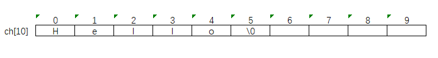
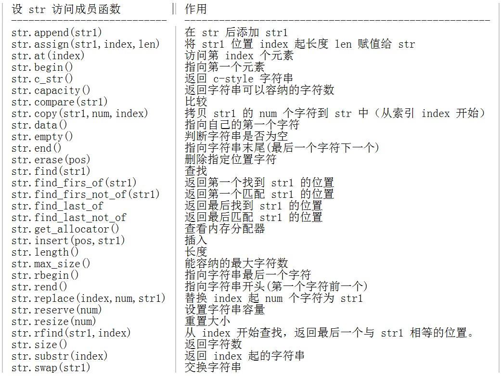

在 C++ 中可通过一些途径高效地处理连续存放的大量数据，以相对低的代价实现数据共享。本次实验共有五个内容：数组、多维数组、字符串、指针变量的声明和使用、区别指针和引用。  

## 知识点  
初始化数组和访问数组  
多维数组  
字符串  
指针变量的声明、赋值和使用  
指针和引用的区别  

## 数组  

数组用于存储一系列类型相同的元素。例如定义五个类型相同的变量，可以不用定义五个变量，只需要将五个值存到一个数组中即可。  

上图定义了一个包含五个元素的 int 数组。第一个元素的编号为 0，最后一个编号为 4；在 C++ 中，数组的第一个元素总是编号为 0。  

数组的声明格式：  

```
type name[elements] //一维数组的声明格式。
```

其中 type 为数组类型，name 为数组名，elements 表示数组长度。数组长度就是数组最多可以存放的元素个数。  

声明不同类型的数组：  

```cpp
int a[5]; //包含五个元素的 int 数组。
float a[5]; //包含五个元素的 float 数组。
char a[5]; //包含五个元素的 char 数组。
```

### 初始化数组  

默认情况下，数组中所有元素的值在声明数组时是未确定的。  

若要在声明数组时，将数组中的元素初始化为特定的值，可以使用 {} 实现，例如初始化数组 int a[5]：  

```
int a[5] = {1,2,3,4,5}
```

初始化数组时，若填充元素不完整，则剩下元素的值默认为 0。例如：  

```
int a[5] = {1,2,3}
```

## 访问数组  

访问数组的表达式为：  

```
name[index]
```

其中 name 为数组名称，index 为元素编号。name[index] 称为数组下标。  

例如定义且初始化一个数组：int a[5] = {1,2,3,4,5}。可以得到 a[0]=1,a[1]=2,a[2]=3,a[3]=4,a[4]=5。  

用图形化方式更直观的表示此数组：  

则 a[2] 可以访问数组中的元素 3。  

新建 arr1.cpp 文件，输入：  

```cpp
#include<iostream>
using namespace std;

int main ()
{
    int a[5] = {1,2,3,4,5}; //初始化数组。
    cout<<a[2]<<endl; //访问数组。
    return 0;
}
```

## 多维数组  

C++ 中支持多维数组，多维数组是指二维及以上的数组，其表达式为：  

```
type name[index1][index2][index3]...[indexn]
```

其中 index 的数量决定了数组的维度，例如 type name[index1][index2] 表示的则是一个二维数组。  

### 二维数组  

可以将二维数组看成一张二维表。定义一个二维数组 a[3][5]：  

二维数组 a[3][5] 可以表示成一张三行五列的二维表，其初始化顺序为：从左到右，从上到下。上图的初始化顺序为：a[0][0]、a[0][1]、a[0][2]、a[0][3]、a[0][4]、a[1][0]...  

新建 arr2.cpp 文件，输入：  

```cpp
#include<iostream>
using namespace std;

int main ()
{
    int a[3][5] = {1,2,3,4,5,6,7,8,9,10,11,12,13,14,15}; //初始化数组。
    cout<<a[1][2]<<endl; //访问数组。
    return 0;
}
```

## C-style 字符串  

C++ 支持起源于 C 语言的 C-style 字符串。  

例如定义一个可以容纳 10 个 char 型字符的数组：  

```cpp
char ch[10];
```

数组 char ch[10]; 可以表示为下图：  

此数组具有存储 10 个字符的能力，但是这个容量不需要完全使用，数组也可以容纳更短的长度。  

按照惯例，字符表示的字符串由特殊字符 null 结尾，其字面值可以写为 \0。  

例如在数组 char ch[10] 中存入一个 Hello 字符串：char ch[10] = "Hello";。  

可以表示为：  

  

注意：null 字符不用手动添加，C++ 在编译的时候会自动添加。  

### cstring  

在 C++ 中有大量用于操作 C-style 字符串的函数，它们集成在头文件 <cstring> 中。其常见的函数：  

```
函数	作用
strcpy(s1,s2)	复制字符串 s2 到 s1
strcat(s1,s2)	将字符串 s2 连接到 s1 末尾
strlen(s)	计算字符串 s 长度
strcmp(s1,s2)	比较字符串 s1 和 s2 的长度，相同为 0；s1 < s2 为 -1；s1 > s2 为 1
strchr(s1,ch)	返回一个指针，指向 s1 中字符 ch 第一次出现的位置
strstr(s1,s2)	返回一个指针，指向 s1 中字符串 s2 第一次出现的位置
```

新建 str1.cpp 文件，输入：  

```cpp
#include <iostream>
#include <cstring>
using namespace std;

int main()
{
    char str1[18] = "Hello ";
    char str2[11] = "Shiyanlou!";

    strcat(str1,str2);//连接字符串。
    cout<<"连接 str1 和 str2："<<str1<<endl;

    cout<<"连接 str1 和 str2 后 str1 的长度："<<strlen(str1)<<endl; //计算字符串 str1 的长度。
    return 0;
}
```

其中 strcat(str1,str2); 将字符串 str2 连接到 str1 末尾，输出 Hello Shiyanlou!  

## 字符串  

C++ 标准库中提供了 string 类，它不仅支持 C-style 的所有操作，而且还丰富了其他功能。  

  

### 初始化字符串  

初始化字符串 str1：  

```
string str1("Hello");
```

上述将 str1 初始化为 Hello，其等效于：  

```
string str1 = "Hello";
```

注意：string 不需要像数组一样指定元素个数，它会自动分配内存。  

新建 str2.cpp 文件，输入：  

```cpp
#include <iostream>
using namespace std;

int main()
{
    string str1 = "Hello ";
    string str2 = "Shiyanlou!";

    str1.append(str2);//连接字符串。
    cout<<"连接 s1 和 s2："<<str1<<endl;

    cout<<"连接 s1 和 s2 后 str1 的长度："<<str1.length()<<endl; //计算字符串 str1 的长度。
    return 0;
}
```

其中 str1.append(str2); 将字符串 str2 连接到 str1 末尾，输出 Hello Shiyanlou!  

在 C++ 中，string 还支持常规操作符，如： ==，<，=，<=，!=，+，+=，[]。新建 str3.cpp 文件，输入：  

```cpp
#include <iostream>
using namespace std;

int main()
{
    string str1 = "Hello ";
    string str2 = "Shiyanlou!";
    cout<<"连接 str1 和 str2："<<str1 + str2<<endl;//连接字符串。
    return 0;
}
```

对于字符串来说，常规操作符 + 的功能为 连接。  

## 指针  

指针是 C++ 从 C 中继承的重要数据类型，它提供了一种较为直接的地址操作手段，使用指针可灵活实现动态内存的分配。  

### 指针变量的声明  

指针是一种数据类型，具有指针类型的变量称为 指针变量，它用于存放内存地址。在使用指针之前，需对指针进行声明，其一般形式为：  

```
type *pointer_name;
```

其中 type 表示所指对象的数据类型，即说明所指内存单元存放的数据类型；* 表示声明一个指针类型的变量；pointer_name 表示指针名。  

声明三个数据类型不同的指针变量：  

```cpp
int *p; //声明 int 型的指针变量 p。
float *p1; //声明 float 型的指针变量 p1。
char *p2; //声明 char 型的指针变量 p2。
```

值得注意的是，指针实际存放的是内存地址，不同类型的指针变量用于指向数据类型不同的变量或常量。  

C++ 中提供了两个与地址相关的运算符：* 和 & 。其中 * 称为 指针运算符，用于获取指针所指变量的值，例如 *p 表示指针 p 所指变量的值；& 称为 取地址运算符，用于获取一个对象的地址，例如有变量 i，则 &i 表示 i 的存储地址。  

## 指针的赋值与使用  

定义指针后我们仅得到了一个用于存储地址的指针变量，若要确定指针变量存放的内存地址，可以通过给指针赋值实现。其基本形式为：  

1.在定义指针时为指针赋值：  

```
type *pointer_name=初始地址;
```

2.在定义指针后为指针赋值：  

```
type *pointer_name;
pointer_name=初始地址;
```

其中 初始地址 为某个对象的内存地址，一般使用 &对象名 获取。  

例如将指针 p 指向变量 po1 的地址，其中变量 po1 的值为 6：  

```cpp
int po1=6; //定义 int 型变量 po1，赋值为 6。
int *p=&po1; //指针变量 p 指向变量 po1 的地址。
```

其等价于：  

```cpp
int po1=6; //定义 int 型变量 po1，赋值为 6。
int *p; //定义指针变量 p
p=&po1; //指针变量 p 指向变量 po1 的地址。
```

我们通过一个例子加深一下指针的定义和使用，新建 pointer1.cpp，输入：  

```cpp
#include<iostream>
using namespace std;

int main ()
{
    int po1=6; //定义 int 型变量 po1，赋值为 6。
    int *p=&po1; //指针变量 p 指向变量 po1 的地址。

    cout << "获取指针所指变量的值: "<<*p<<endl;
    cout << "获取指针的内存地址: "<<&p<<endl;
    return 0;
}
```

其中 *p 运用指针运算符 * 获取指针 p 所指变量的值；&p 运用取地址运算符 & 获取指针 p 的地址。  

引用是指对已存在的变量别名，我们可以使用引用名来指向对象。  

引用与指针主要有三个区别：  

- 可以通过 指针名=0 描述一个空指针，但不存在空引用。  
- 指针可在任何时间进行初始化操作，而引用只能在定义时进行初始化操作。  
- 指针变量指向内存的一个存储单元；而引用只不过是原变量的一个别名而已。  

声明引用变量的基本格式为：  

```
type &引用名=被指对象名；
```

& 在这里是标识作用，而非取地址运算符。  

例如定义引用 x，它是整型变量 i 的引用：  

```
int &x=i;
```

我们通过 初始化时间 来区别一下指针和引用，新建 pointer2.cpp 文件，输入：  

```cpp
#include<iostream>
using namespace std;

int main ()
{
    int i=3;
    int j=4;

    int &x=i; //定义引用 x，它是整型变量 i 的引用。
    int *s; //定义指针 s。
    s=&j; //指针 s 指向整型变量 j 的地址。

    cout << "初始化引用 x: " << x << endl;
    cout << "初始化指针 s: " << *s << endl;

    return 0;
}
```

其中 int &x=i; 表示在 定义引用时 进行的初始化操作。s=&j; 表示在 定义指针后 进行的初始化操作。  

