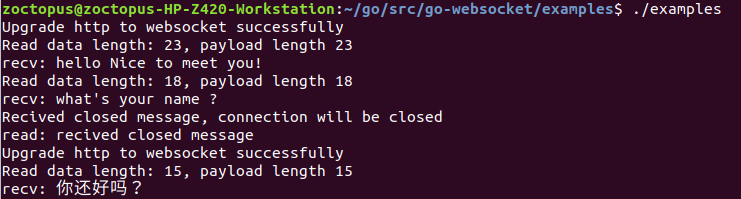
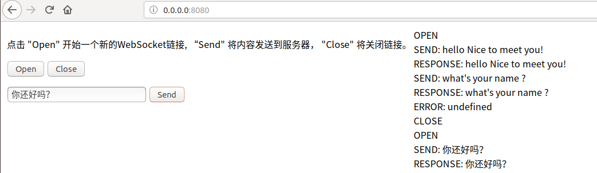

## 用Go语言实现WebSocket协议  

### 涉及知识点  
- Go 的基本语法和使用  
- WebSocket 协议的握手过程  
- WebSocket 协议数据帧  
- WebSocket 协议中的一些算法  
- 掩码处理  
- WebSocket 链接的实现  

### 运行  
- 服务端  
  

- 客户端  
  

## 注意  
1，涉及WebSocket相关资料，可查看Wiki。