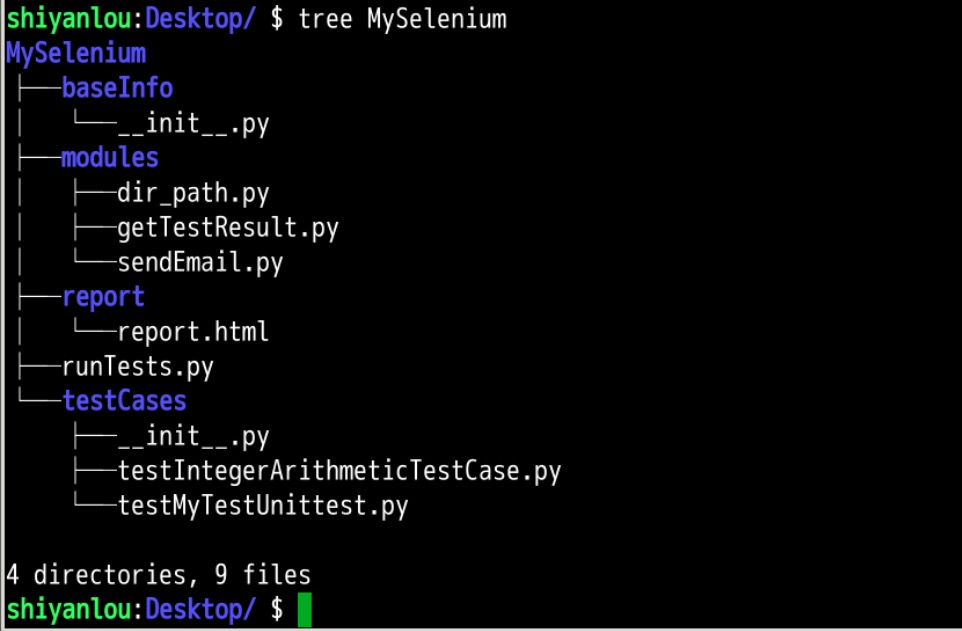

## 介绍  

```

1.1 实验内容

本节实验将前面讲的所有内容利用 unittest 单元测试库以及简单的面向对象的思想进行封装，使代码形成框架。
1.2 实验知识点

    使用 HTMLTestRunner 生成测试报告
    将测试用例进行封装形成框架

1.3 安装需要的库：

sudo pip3 install --upgrade pip
sudo pip3 install selenium
[copy]

1.4 实验环境

    Firefox 浏览器
    python 3.5
    geckodriver 0.22.0
    selenium 3


```

## 步骤  

​ 对于自动化测试人员来说，每执行完一次测试用例都要生成相应的测试报告方便查看测试结果，因此我们使用 HTMLTestRunner 生成测试报告。 ​ ​注意：本实验将会用到上一个实验的代码，如果环境没有保存，可以通过上一个实验文档末尾提供的链接下载代码  

### 2.1.1 下载 HTMLTestRunner.py  

```

    下载地址：

$ wget https://labfile.oss.aliyuncs.com/courses/1163/HTMLTestRunner.py
[copy]

    将下载好的文件移至python3的文件夹下：

$ sudo mv HTMLTestRunner.py /usr/lib/python3/dist-packages/
[copy]

然后打开之前写好的MySelenium/runTests.py文件。添加代码：

from HTMLTestRunner import HTMLTestRunner
[copy]

保存，然后执行该文件，如果没有报错，证明导入成功。

然后我们利用HTMLTestRunner来生成测试报告。

先在MySelenium文件夹下新建文件夹，命名为report

$ mkdir /home/shiyanlou/Desktop/MySelenium/report
[copy]

然后将runTests.py文件代码改为：

#! /usr/bin/python3

import unittest
from HTMLTestRunner import HTMLTestRunner

discover = unittest.defaultTestLoader.discover("/home/shiyanlou/Desktop/MySelenium/testCases/", pattern="test*.py")
filename = "/home/shiyanlou/Desktop/MySelenium/report/report.html"
fp = open(filename, 'wb')
runner = HTMLTestRunner(stream=fp, title='AutoTest', description='My Selenium auto test')
runner.run(discover)
fp.close()


    解释：

    filename为测试报告存放的地址，以及保存的文件名。 runner = HTMLTestRunner(stream=fp, title='AutoTest', description='My Selenium auto test')，其中stream为选择打开的文件，title为测试报告的标题，description为测试报告的描述。

```

用系统自带的python3执行该文件：执行完成以后，可以进入report文件夹，会看到文件夹中自动生成了report.html，到此为止，我们便利用HTMLTestRunner生成了测试报告。  

### 2.2 将代码封装形成框架  


- 封装思想  

代码封装应用的是面向对象的思想，即将公共方法提取出来，用到的时候采用调用的方式。这样做的好处有四点：  

i. 减少代码冗余  

ii. 减少代码耦合  

iii. 方便定位代码报错  

iv. 方便代码维护  

- 框架结构  

  

```


    其中：

        baseInfo文件夹存放用例用到的各种参数，如用户名、密码等

        modules文件夹存放各种固定方法，如发送邮件、获取测试用例、读取测试结果等

        report文件夹存放生成的测试报告

        testCases文件夹存放测试用例


```


[]()
