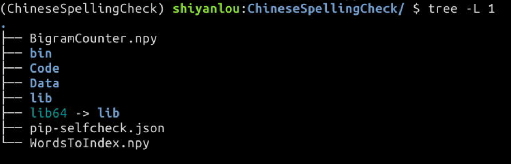

# Python 实现中文错别字高亮系统  

## 实验内容  

错别字一直是挺影响读者体验的东西。实验楼作为以文档为基础的教育网站，已经由用户纠正了很多文档中的错别字。这次我们希望上线一个错别字高亮系统，输入我们的 MarkDown 文档，输出一个高亮过疑似错别字的 HTML 文件。  

## 实验知识点  

Python3 的基本用法  
中文分词库 "Jieba" 的基本使用  
BeautifulSoup 库的基本使用  


## 开发准备  

- 创建ChineseSpellingCheck 文件夹, 将其作为课程的工作目录。  
- 首先将 conda 加入 .zshrc 中并创建虚拟环境  

```
$ echo ". /home/shiyanlou/anaconda3/etc/profile.d/conda.sh" >> ~/.zshrc && source ~/.zshrc
$ conda create -n ChineseSpellingCheck python=3.6 -y
$ conda activate ChineseSpellingCheck
```

等 ChineseSpellingCheck 环境建立好，我们就能够在这个独立的 Python 虚拟环境下进行我们的实验了

- 安装 Jieba 库  

```
$ pip install jieba beautifulsoup4 numpy
```

注意 pip 前面不能加 sudo，加了 sudo 就不是在虚拟环境下安装了。  

## 项目文件结构  

  

## 实验步骤  

### 5.1 实现前后关系字典  

### 5.2 借助搜索引擎判断单词是否常用  


### Markdown解析器  

```
$ pip install mistune
```

### 测试  

```
$ python TestOfDoc.py ../test1.md results.html
```

就能够在 Code 文件夹下找到我们的 result.html 文件，用 firefox 打开：  


## 参考资料  

- [WikiPython TimeComplexity](https://wiki.python.org/moin/TimeComplexity)  